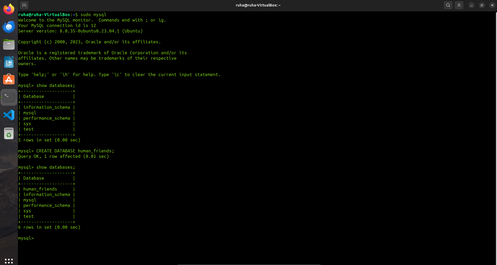

# <u>**Итоговая контрольная работа по блоку специализация**</u>

### Необходимо организовать систему учета для питомника в котором живут домашние и вьючные животные

---

---

# **`З Д А Н И Е:`**

1. Используя команду cat в терминале операционной системы Linux, создать
   два файла Домашние животные (заполнив файл собаками, кошками,
   хомяками) и Вьючные животными заполнив файл Лошадьми, верблюдами и
   ослы), а затем объединить их. Просмотреть содержимое созданного файла.
   Переименовать файл, дав ему новое имя (Друзья человека).

```shell
       $ cat > Pets.txt
       $ cat > Pack_animals.txt
       $ cat Pack_animals.txt Pets.txt > Animals.txt
       $ cat Animals.txt
       $ mv Animals.txt HumanFriends.txt
```


---

---

2. Создать директорию, переместить файл туда.

```shell
        $ mkdir Animals
        $ mv HumanFriends.txt ./Animals/HumanFriends.txt
```


---

---

3. Подключить дополнительный репозиторий MySQL. Установить любой пакет
   из этого репозитория.

```shell
        $ sudo wget -c https://dev.mysql.com/get/mysql-apt-config_0.8.29-1_all.deb
        $ sudo dpkg -i mysql-apt-config_0.8.29-1_all.deb
        $ sudo apt update

```


```shell
        $ sudo apt install mysql-client-core-8.0
```


```shell
        $ sudo apt-get install mysql-server
```


```shell
        $ systemctl status mysql.service
```


---

---

4. Установить и удалить deb-пакет с помощью dpkg.

```shell
      $ sudo dpkg -i mysql-apt-config_0.8.29-1_all.deb
      $ sudo dpkg -r mysql-apt-config
      $ sudo dpkg --purge mysql-apt-config
```

---

---

5. Выложить историю команд в терминале ubuntu.

## 

---

6. Нарисовать диаграмму, в которой есть класс родительский класс, домашние
   животные и вьючные животные, в составы которых в случае домашних
   животных войдут классы: собаки, кошки, хомяки, а в класс вьючные животные
   войдут: Лошади, верблюды и ослы).

## 

---

7. В подключенном MySQL репозитории создать базу данных “Друзья
   человека”

```
    CREATE DATABASE human_friends;
```

## 

---

8. Создать таблицы с иерархией из диаграммы в БД

```
    CREATE TABLE animals
    (
    	Id INT AUTO_INCREMENT PRIMARY KEY,
	    Class_name VARCHAR(20)
    );

    INSERT INTO animals (Class_name)
    VALUES ('Pack_animals'), ('Pets');


    CREATE TABLE pack_animals
    (
	    Id INT AUTO_INCREMENT PRIMARY KEY,
        Genus_name VARCHAR (20),
        Class_id INT,
        FOREIGN KEY (Class_id) REFERENCES animals (Id)
        ON DELETE CASCADE ON UPDATE CASCADE
    );


    INSERT INTO pack_animals (Genus_name, Class_id)
    VALUES ('Horses', 1), ('Camels', 1), ('Donkeys', 1);


    CREATE TABLE pets
    (
	    Id INT AUTO_INCREMENT PRIMARY KEY,
        Genus_name VARCHAR (20),
        Class_id INT,
        FOREIGN KEY (Class_id) REFERENCES animals (Id)
        ON DELETE CASCADE ON UPDATE CASCADE
    );


    INSERT INTO pets (Genus_name, Class_id)
    VALUES ('Cats', 2), ('Dogs', 2), ('Hamsters', 2);

```

## 

---

9. Заполнить низкоуровневые таблицы именами(животных), командами
   которые они выполняют и датами рождения

```
CREATE TABLE Cats
(
    Id INT AUTO_INCREMENT PRIMARY KEY,
    Name VARCHAR(20),
    Birthday DATE,
    Commands VARCHAR(50),
    Genus_id int,
    Foreign KEY (Genus_id) REFERENCES pets (Id) ON DELETE CASCADE ON UPDATE CASCADE
);


INSERT INTO Cats (Name, Birthday, Commands, Genus_id)
VALUES ('Karamelka', '2022-02-02', 'kis-kis', 1),
('Korjik', '2021-01-01', "bris", 1),
('Kompot', '2020-01-01', "kis-kis", 1);


CREATE TABLE Dogs
(
    Id INT AUTO_INCREMENT PRIMARY KEY,
    Name VARCHAR(20),
    Birthday DATE,
    Commands VARCHAR(50),
    Genus_id int,
    Foreign KEY (Genus_id) REFERENCES pets (Id) ON DELETE CASCADE ON UPDATE CASCADE
);

INSERT INTO Dogs (Name, Birthday, Commands, Genus_id)
VALUES ('Rex', '2021-01-01', 'Come, Sit, Bite, Stop', 2),
('Killer', '2022-02-12', "Fetch, Down, Plase", 2),
('Alpha', '2020-01-01', "Sit, Stay, Jump, Track", 2),
('Mira', '2019-02-12', "Heel, Down, Come, Plase", 2);


CREATE TABLE Hamsters
(
    Id INT AUTO_INCREMENT PRIMARY KEY,
    Name VARCHAR(20),
    Birthday DATE,
    Commands VARCHAR(50),
    Genus_id int,
    Foreign KEY (Genus_id) REFERENCES pets (Id) ON DELETE CASCADE ON UPDATE CASCADE
);


INSERT INTO Hamsters (Name, Birthday, Commands, Genus_id)
VALUES ('Truckee', '2022-12-12', NULL, 3),
('Barry', '2021-01-01', NULL, 3),
('Norbert', '2022-02-02', NULL, 3),
('Daggett', '2021-11-11', NULL, 3);


CREATE TABLE Horses
(
    Id INT AUTO_INCREMENT PRIMARY KEY,
    Name VARCHAR(20),
    Birthday DATE,
    Commands VARCHAR(50),
    Genus_id int,
    Foreign KEY (Genus_id) REFERENCES pack_animals (Id) ON DELETE CASCADE ON UPDATE CASCADE
);


INSERT INTO Horses (Name, Birthday, Commands, Genus_id)
VALUES ('Flash', '2020-02-02', NULL, 1),
('Belle', '2019-01-01', NULL, 1),
('Sivka', '2018-01-12', NULL, 1),
('Burka', '2021-12-12', NULL, 1);


CREATE TABLE Donkeys
(
    Id INT AUTO_INCREMENT PRIMARY KEY,
    Name VARCHAR(20),
    Birthday DATE,
    Commands VARCHAR(50),
    Genus_id int,
    Foreign KEY (Genus_id) REFERENCES pack_animals (Id) ON DELETE CASCADE ON UPDATE CASCADE
);


INSERT INTO Donkeys (Name, Birthday, Commands, Genus_id)
VALUES ('Ia', '2019-02-12', NULL, 2),
('Iu', '2020-01-01', "", 2),
('Io', '2021-01-11', "", 2),
('Ie', '2022-12-12', NULL, 2);


CREATE TABLE Camels
(
    Id INT AUTO_INCREMENT PRIMARY KEY,
    Name VARCHAR(20),
    Birthday DATE,
    Commands VARCHAR(50),
    Genus_id int,
    Foreign KEY (Genus_id) REFERENCES pack_animals (Id) ON DELETE CASCADE ON UPDATE CASCADE
);

INSERT INTO Camels (Name, Birthday, Commands, Genus_id)
VALUES ('Lucky', '2022-02-12', 'run', 3),
('Quasimodo', '2019-03-12', "stop", 3),
('Jacob', '2015-07-12', "down", 3),
('Heinz', '2022-12-10', "go-go-go", 3);
```

## 

---

10. Удалив из таблицы верблюдов, т.к. верблюдов решили перевезти в другой
    питомник на зимовку. Объединить таблицы лошади, и ослы в одну таблицу.

```
SET SQL_SAFE_UPDATES = 0;
DELETE FROM Camels;

SELECT Name, Birthday, Commands FROM Horses
UNION SELECT  Name, Birthday, Commands FROM Donkeys;

```

## 

---

11. Создать новую таблицу “молодые животные” в которую попадут все животные старше 1 года, но младше 3 лет и в отдельном столбце с точностью до месяца подсчитать возраст животных в новой таблице

```
CREATE TEMPORARY TABLE animals AS
SELECT *, 'Cats' as genus FROM Cats
UNION SELECT *, 'Dogs' AS genus FROM Dogs
UNION SELECT *, 'Hamsters' AS genus FROM Hamsters
UNION SELECT *, 'Horses' AS genus FROM Horses
UNION SELECT *, 'Donkeys' AS genus FROM Donkeys;


CREATE TABLE yang_animals AS
SELECT Name, Birthday, Commands, genus, TIMESTAMPDIFF(MONTH, Birthday, CURDATE()) AS Age_in_month
FROM animals WHERE Birthday BETWEEN ADDDATE(curdate(), INTERVAL -3 YEAR) AND ADDDATE(CURDATE(), INTERVAL -1 YEAR);

SELECT * FROM yang_animals;
```

## 

---

12. Объединить все таблицы в одну, при этом сохраняя поля, указывающие на
    прошлую принадлежность к старым таблицам.

```

SELECT c.Name, c.Birthday, c.Commands, ha.Genus_name, ya.Age_in_month
FROM Cats c
LEFT JOIN yang_animals ya ON ya.Name = c.Name
LEFT JOIN pets ha ON ha.Id = c.Genus_id
UNION
SELECT d.Name, d.Birthday, d.Commands, ha.Genus_name, ya.Age_in_month
FROM Dogs d
LEFT JOIN yang_animals ya ON ya.Name = d.Name
LEFT JOIN pets ha ON ha.Id = d.Genus_id
UNION
SELECT hm.Name, hm.Birthday, hm.Commands, ha.Genus_name, ya.Age_in_month
FROM Hamsters hm
LEFT JOIN yang_animals ya ON ya.Name = hm.Name
LEFT JOIN pets ha ON ha.Id = hm.Genus_id
UNION
SELECT h.Name, h.Birthday, h.Commands, pa.Genus_name, ya.Age_in_month
FROM Horses h
LEFT JOIN yang_animals ya ON ya.Name = h.Name
LEFT JOIN pack_animals pa ON pa.Id = h.Genus_id
UNION
SELECT d.Name, d.Birthday, d.Commands, pa.Genus_name, ya.Age_in_month
FROM Donkeys d
LEFT JOIN yang_animals ya ON ya.Name = d.Name
LEFT JOIN pack_animals pa ON pa.Id = d.Genus_id;
```

## 

---

13.Создать класс с Инкапсуляцией методов и наследованием по диаграмме.

14.Написать программу, имитирующую работу реестра домашних животных.


